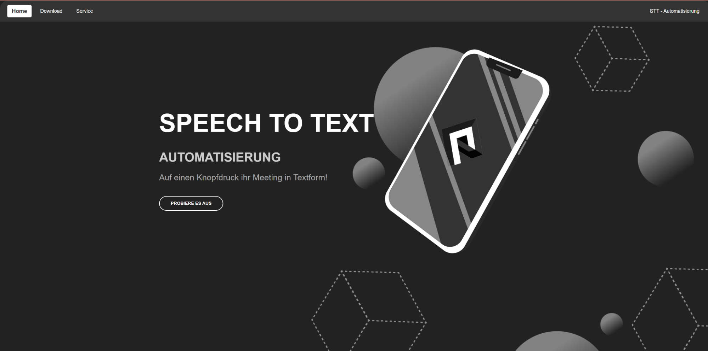
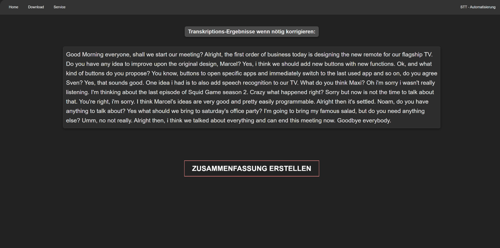
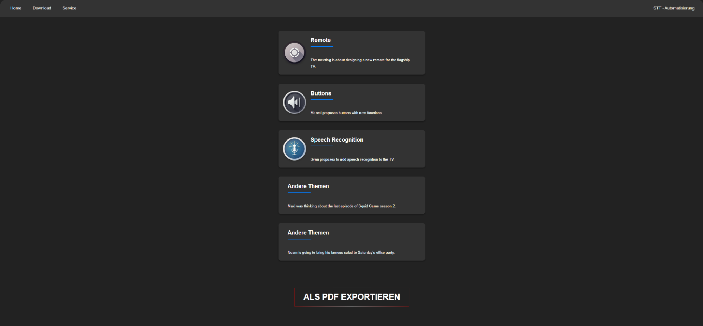

# 🎙️ MeetingCompanion — Speech-to-Text Automatisierung

Eine Webanwendung, die Meetings per Knopfdruck aufzeichnet, automatisch transkribiert und in eine strukturierte, thematisch gegliederte Zusammenfassung verwandelt — exportierbar als PDF.

Entstanden im Rahmen eines Hochschulprojekts von **Sven Schirmaier, Marcel Ritter, Noam Hartmann und Maximilian Flack**.

---

## 📸 Screenshots

**Startseite**
Einstieg über eine Landingpage, die direkt zur Aufnahme führt.



**Transkription korrigieren**
Nach der Aufnahme wird das Meeting automatisch per Speech-to-Text in Text umgewandelt. Der Text bleibt editierbar, bevor die Zusammenfassung erstellt wird.



**Automatische Zusammenfassung**
Die KI gruppiert die besprochenen Inhalte thematisch in einzelne Karten und exportiert das Ergebnis auf Wunsch als PDF.



---

## ✨ Funktionen

- **Meeting-Aufnahme im Browser**: Aufnahme starten per Klick, ohne zusätzliche Software
- **Speech-to-Text**: Automatische Transkription der Aufnahme
- **Manuelle Korrektur**: Das Transkript lässt sich vor der Weiterverarbeitung noch anpassen
- **KI-Zusammenfassung**: Die wichtigsten Gesprächspunkte werden erkannt und thematisch als einzelne Karten aufbereitet
- **PDF-Export**: Die fertige Zusammenfassung lässt sich mit einem Klick als PDF herunterladen

---

## 🛠️ Technischer Aufbau

**Frontend**
- Reines **HTML5**, **CSS3** und **JavaScript** (ES-Module) — kein Framework
- Mehrere Seiten: `home.html` (Landingpage), `index.html` (Aufnahme, Transkription & Zusammenfassung), `download.html`, `service.html`

**Backend**
- **Node.js** mit **Express** (`server.js`) als schlanker API-Server
- **CORS** für die Kommunikation zwischen Frontend und Backend
- Konfiguration über Umgebungsvariablen (`dotenv`) — kein hartcodierter API-Key im Code

**KI-Funktionalität**
- Anbindung an die **Hugging Face Inference API** (`@huggingface/inference`) für Speech-to-Text und automatische Textzusammenfassung

**PDF-Export**
- **Puppeteer** rendert die Zusammenfassung serverseitig zu einem PDF-Dokument

---

## 📁 Projektstruktur

```
├── home.html                 # Landingpage
├── index.html                # Aufnahme, Transkription & Zusammenfassung
├── download.html             # Download-Seite
├── service.html              # Service-/Kontaktseite
├── script.js                 # Frontend-Logik
├── server.js                 # Express-Backend & Hugging-Face-Anbindung
├── style.css / indexstyle.css / stylehome.css / styledownload.css / styleservice.css
├── bilder/                   # Bildmaterial für die Seiten
├── DEFAULT.env                # Vorlage für die eigene .env-Datei
├── package.json
```

---

## 🚀 Lokal ausführen

1. Einen **Hugging Face Access Token** erstellen und unter "Inference" alle drei Berechtigungen aktivieren
2. **Node.js** und **npm** installieren
3. In VS Code die **Live Server**-Extension installieren
4. Repository klonen
5. Abhängigkeiten installieren:
   ```bash
   npm i
   ```
6. Ordner `public/temp/icons` im Projekt-Root anlegen
7. `.env`-Datei aus `DEFAULT.env` erstellen und den eigenen Hugging-Face-Key eintragen:
   ```bash
   cp DEFAULT.env .env
   ```
8. Backend starten:
   ```bash
   node --watch server.js
   ```
9. Frontend über einen VS Code Live Server auf **Port 5500** starten

---

## 👥 Team

Sven Schirmaier · Marcel Ritter Buisan · Noam Hartmann · Maximilian Flack
